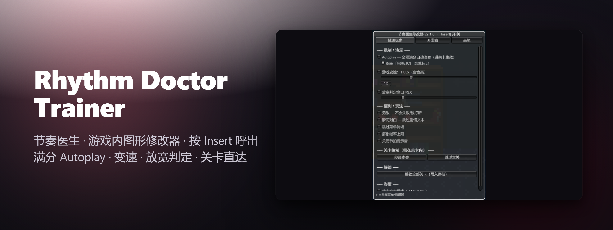
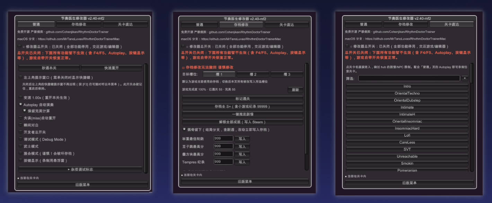

<!-- Language switch -->
**简体中文** | [English](README.en.md)

<div align="center">



<sub> <a href="docs/assets/promo.mp4">观看 30 秒宣传片</a></sub>

# 节奏医生 全平台修改器  Rhythm Doctor Trainer

**按下 F3 你就是伊恩医生**

《节奏医生》游戏内图形修改器，专为**单机录制完美通关**而生 —— 绝不用于在线对战。

<br>

[](LICENSE)
[](https://github.com/Cohenjikan/RhythmDoctorTrainer/releases)
[](https://github.com/Cohenjikan/RhythmDoctorTrainer/stargazers)
[](https://github.com/Cohenjikan/RhythmDoctorTrainer/issues)
[](https://github.com/BepInEx/BepInEx)
[](#兼容性)
[](#免责声明)

<br>

</div>

---

> [!IMPORTANT]
> **仅供单机自娱与录制**（例如制作完美通关视频）。本项目不触碰任何在线 / 对战 / 排行榜逻辑，也请勿用于会影响他人公平性的场景。与 7th Beat Games **无任何关联**。
>
> **完全免费、开源（MIT），严禁倒卖。** 内置完整性校验 

## 安装

各平台菜单热键统一为 **F3**。

### Windows（BepInEx / Doorstop，不改动任何游戏文件）

右键左下角 Windows 徽标，选择 **终端 或 PowerShell** 并运行：

```powershell
irm https://raw.githubusercontent.com/Cohenjikan/RhythmDoctorTrainer/refs/heads/main/win_install.ps1 | iex
```

脚本会**自动定位 Steam 里的游戏**、**缺少 BepInEx 时自动安装**、并下载插件与一份中日韩字体。进入关卡按 **F3** 呼出菜单。

卸载：

```powershell
irm https://raw.githubusercontent.com/Cohenjikan/RhythmDoctorTrainer/refs/heads/main/win_uninstall.ps1 | iex
```
> 旧的根目录地址（`win_install.ps1` / `win_uninstall.ps1`）仍可用——它们是指向上面新路径的转发垫片。手动安装参考 [Windows 安装详解](#windows-安装详解bepinex)。


### macOS / Linux（原生，无需 BepInEx、无需 .NET SDK、无需编译）

同一套预编译产物在 macOS 与 Linux 上**完全通用**。安装：

```bash
curl -fsSL https://raw.githubusercontent.com/Cohenjikan/RhythmDoctorTrainer/refs/heads/main/install.sh | bash
```

脚本会**自动识别架构**，下载预编译 DLL + 与你架构匹配的织入器 + 一份中日韩字体，然后把加载器织入游戏启动函数。进入游戏按 **F3** 呼出菜单。

卸载（恢复 `Assembly-CSharp.dll` 备份）：

```bash
curl -fsSL https://raw.githubusercontent.com/Cohenjikan/RhythmDoctorTrainer/refs/heads/main/uninstall.sh | bash
```
> 游戏更新或在 Steam 里「验证文件完整性」会还原补丁——重跑一次安装脚本即可。


---

## 功能展示：




## 核心功能：

### 帧级满分 Autoplay


引擎按谱面满分自动演奏，**无输入延迟、画面无「autoplay on!」LED 字样**，与真人手打无异 —— 配合隐藏 HUD 即可录出完美素材。

- 保留游戏在 autoplay 下通常会隐藏的 **「完美 / JCI」结算标记**（默认开启）
- 用的是引擎原生标志 `DebugSettings.Auto`，**不是键盘宏 / 模拟按键**
- 想自己手打？把开关关掉即可

<br clear="right">

### 失误(miss)自动重开

针对追求 perfect 的高手玩家，本修改器提供失误时自动重开的功能

<br clear="right">

### 游戏变速 0.1×–3×（含音高）

慢放抠细节、或加速速通；**BPM 与音源音高同步缩放**，听感一致。

> 在关卡**开始 / 重开**时生效，**无法中途变速**（引擎在加载时固定 BPM 与音高，中途改会失同步）。菜单内提供「重开本关并应用」按钮。

### 放宽判定窗口/无敌


- **放宽判定窗口 ×1–×10**（默认 ×3）—— 手打也能轻松全 Perfect
- **无敌** —— 永不失败、不被中途打断
- **瞬间对白 / 跳过菜单转场 / 解锁帧率上限 / 关闭节拍提示音**

### 关卡/隐藏关卡 直达

列出**全部关卡**（带文字筛选），点一下**直接进入**，绕过 hub 的剧情 / NPC 揭示限制 —— 配合 Autoplay 即可录制任意关卡，包括被剧情锁住的那些。

<br clear="right">

### 开发者 / 调试模式 + 成就控制

**开发者模式（isDev）/ 调试模式（Debug）**，以及一组底层调试开关（NoPro / ForceNoSteamworks / EmulateMobile / RunningOnSteamDeck / DebugAmbience / PaigeStays / PauseOnFocusLost）

<br clear="right">

### 存档修改

读取并应用音画校准值（视觉 / 输入 / 延迟）、编辑「举重节奏」无限模式最佳轮数、触发展会(Booth)模式 / 狗狗模式 / 隐藏曲 *Song of the Sea*。

- **佩奇是否留下**
- **解锁全部成就**（ 会写入你的 Steam 账号）/ **关闭成就发放**（作弊时防污染账号）
- 一键 S+
- 一键推进剧情

## 架构：一套共享内核 + 两个轻量宿主壳

整个修改器只有**一份**逻辑。原本约 800 行的 IMGUI 菜单曾在 Windows 与 macOS 两份源码里重复，现已收敛为单一可信源：

- **`Shared/`** —— 唯一可信源，通过 `<Compile Include="../Shared/*.cs" />` 同时编进两个构建：
  - `TrainerInfo.cs` —— Guid / Name / Version / 水印（**改版本号只在这里改**）。
  - `Cheats.cs` —— 共享状态 + 中日韩字体加载器（CjkFont）。
  - `Patches.cs` —— Harmony 补丁。
  - `TrainerMenu.cs` —— 整个 IMGUI 菜单 + 逐帧作弊应用。
  - `IHost.cs` —— 平台接缝（日志 + 菜单热键 + 持久化偏好）。
- **`windows/`** —— `Plugin.cs`，一个实现 `IHost` 的轻量 BepInEx `BaseUnityPlugin` 壳；`RDTrainer.csproj`。
- **`mac/`** —— `TrainerHost.cs`，一个实现 `IHost` 的轻量 `MonoBehaviour` 壳；`Loader.cs`（被织入的入口点）；`Log.cs`；`RDTrainerMac.csproj`。这一个 `netstandard2.1` 构建**同时服务 macOS 与 Linux**。
- **`patcher/`** —— `Program.cs` + `Patcher.csproj`：一个 `net8.0` 的 Mono.Cecil 静态织入器，把一次 `Loader.Init()` 调用注入游戏的 `RDStartup.Setup`。

两种注入方式精神不变：**Windows** 用 BepInEx / Doorstop（不改动任何游戏文件）；**macOS / Linux** 用 Cecil 织入器把加载器织进 `Assembly-CSharp.dll`（并留一份 `.rdtrainer-backup` 以便干净卸载）。

|          | Windows                             | macOS / Linux                          |
| -------- | ----------------------------------- | -------------------------------------- |
| 注入方式 | BepInEx 5 + Doorstop（winhttp.dll） | Mono.Cecil 静态织入游戏启动函数        |
| 宿主壳   | `windows/Plugin.cs`（BaseUnityPlugin） | `mac/TrainerHost.cs`（普通 MonoBehaviour，由 Loader 生成） |
| 打补丁库 | BepInEx 自带的 HarmonyX             | 独立 0Harmony.dll（Lib.Harmony 2.4.2） |
| 加载方式 | BepInEx chainloader 直接加载        | Cecil 织入 `RDStartup.Setup` 调用 `Loader.Init()` |
| 菜单逻辑 | 同一份 `Shared/` 内核               | 同一份 `Shared/` 内核                  |

### 分发产物（`dist/`）

- `dist/windows/RDTrainer.dll` —— BepInEx 插件。
- `dist/mac/RDTrainerMac.dll` 与 `dist/mac/0Harmony.dll` —— **各一份**，**macOS 与 Linux 共用**。

织入器的自包含可执行文件（`patcher-osx-arm64`、`patcher-osx-x64`、`patcher-linux-x64`）**不在仓库里**——它们随 GitHub Releases 发布，`install.sh` 只下载与你架构匹配的那一个。

### 为什么补丁器分三份，DLL 却只有一份？

修改器的托管 DLL（`RDTrainerMac.dll`、`0Harmony.dll`）是**平台无关的 CIL**，在任何操作系统 / 架构上都原样运行，所以全世界只需要**一份**。而织入器是一个**自包含可执行文件**，内部打包了一份原生 .NET 运行时（这样用户机器上什么都不用预装），这种东西天生**按架构区分**，于是有了三个构建（`osx-arm64` / `osx-x64` / `linux-x64`）。Windows 完全用不到这个织入器——它走 BepInEx。

## Windows 安装详解（BepInEx）

适用于 **Steam 正式版**（Unity 6 / x64 / Mono）。需要先装 BepInEx 5。

### 第一步：装 BepInEx 5（x64, Mono）

1. 到 [BepInEx Releases](https://github.com/BepInEx/BepInEx/releases) 下载 **`BepInEx_win_x64_5.4.23.x.zip`**。
2. 把压缩包内容**解压到游戏根目录**（即与 `Rhythm Doctor.exe` 同一层；解压后会多出 `winhttp.dll`、`BepInEx/` 等）。
   > 游戏目录怎么找：Steam → 右键《Rhythm Doctor》→ 管理 → 浏览本地文件。
3. **启动一次游戏再退出**，让 BepInEx 生成 `BepInEx/plugins`、`BepInEx/config` 等文件夹。

### 第二步：装本修改器

**方法 A（一键脚本，推荐）** —— 直接运行 [安装](#安装) 一节里的 PowerShell 一行命令，它会自动定位游戏、补装 BepInEx、下载插件与字体。

**方法 B（手动）** —— 下载 [`dist/windows/RDTrainer.dll`](dist/windows/RDTrainer.dll)，放进：

```text
<游戏目录>\BepInEx\plugins\RDTrainer.dll
```

### 验证

启动游戏后打开 `<游戏目录>\BepInEx\LogOutput.log`，看到这行即成功（水印部分按你的版本显示完整项目地址）：

```log
[Info : RD Trainer (节奏医生修改器)] RD Trainer (节奏医生修改器) v2.50 loaded · 本工具免费开源，严禁倒卖 · FREE · github.com/Cohenjikan/RhythmDoctorTrainer · Menu key = F3
```

进入任意关卡，按 **F3** 呼出菜单。

## 快速上手

1. 进入任意关卡，按 **F3** 开 / 关菜单。
2. **录制完美通关**：在「普通」页打开 **Autoplay** → 进入关卡 → 用 OBS 等录屏。
3. **录被剧情锁住的关卡**：切到「**关卡直达**」页，点关卡名直接进入。
4. **变速**：拖动滑块后需在关卡**开始 / 重开**时生效（菜单内有「重开本关并应用」按钮）。
5. **想自己手打**：把「普通」页的 Autoplay 关掉即可。

## 须知 / 注意事项

- **仅单机 / 离线** —— 不触碰任何在线、对战、排行榜逻辑；请勿用于影响他人公平性的场景。
- **变速只在关卡开始 / 重开时生效**，不能中途变（引擎在加载时固定 BPM 与音高）；用「重开本关并应用」。
- **「解锁全部成就」会写入你真实的 Steam 账号** —— 介意者请配合「关闭成就发放」使用。
- **调试模式会在画面显示调试文字**，不适合干净录制。
- **删档 / 推进剧情等操作会修改你的存档文件** —— 删档不可恢复（有二次确认）。
- **修改游戏可能违反其 EULA / 服务条款**，使用风险自负（账号处罚、存档损坏均有可能）。
- **非官方粉丝工具**，与 7th Beat Games 无关联、未获授权；不分发任何游戏源码、DLL、音频或美术素材。
- **Windows 需要 BepInEx 5（x64, Mono）；macOS / Linux 无此依赖**（走 Cecil 织入）；游戏大版本更新后可能需要适配才能继续加载，**不保证**永久兼容。
- **macOS / Linux：游戏更新或 Steam「验证文件完整性」会还原补丁**——重跑一次安装脚本即可。
- **删除或篡改水印会让修改器整体失效**（设计如此，完整性闸门）。

## 从源码构建

> 普通用户**不必**自行构建——直接用上面的一键脚本即可。仓库已自带预编译产物（`dist/`）。

需要 .NET SDK，并有一份对应平台的游戏副本（用于引用 DLL）。三个工程都通过 `<Compile Include="../Shared/*.cs" />` 编入同一份 `Shared/` 内核；所有工程都用 `Private=false` 引用游戏 DLL —— **不会重新分发**它们。

```bash
# Windows 插件（netstandard2.1，需一份已装 BepInEx 的游戏副本）
# 默认读取 D:\steam\steamapps\common\Rhythm Doctor；其它路径用 -p:GameDir=... 覆盖
dotnet build windows/RDTrainer.csproj -c Release -p:GameDir="你的\Rhythm Doctor"

# macOS / Linux 通用的修改器 DLL（netstandard2.1）
dotnet build mac/RDTrainerMac.csproj -c Release -p:Managed="<游戏>/.../Data/Managed"

# 自包含织入器，按架构各发布一个（osx-arm64 / osx-x64 / linux-x64）
dotnet publish patcher/Patcher.csproj -c Release -r osx-arm64
```

Windows 插件产物在 `windows/bin/Release/RDTrainer.dll`。

## 工作原理（简述）

修改器**不做内存偏移 / AOB 扫描**，只通过 Harmony 调用游戏自身已有的开关和函数（这些补丁都在共享的 `Shared/Patches.cs` 里，两个平台共用）：

| 功能 | 实现 |
|---|---|
| Autoplay | 设 `DebugSettings.instance.Auto`（刻意绕开会闪 LED 字样的 `ToggleAutoplay`） |
| 保留完美标记 | Harmony postfix 补丁 `LevelBase.isZeroOffset`（仅在零偏移且零失误时强制 true） |
| 变速 | 写静态 `scnGame.levelSpeed`，引擎在关卡 Start 时据此缩放 BPM 与音高 |
| 放宽判定 | postfix `scnGame.GetHitMargin` 乘以倍率 |
| 无敌 | 反射定位全程序集所有单参 `FailLevel`，prefix 跳过原逻辑 |
| 关卡直达 | 调用 `scnBase.GoToLevelWithEnum(Level)` |

只是「调用游戏自己的逻辑」，因此天然比内存修改稳定，游戏小更新通常也不易失效。详见 [ABOUT.md](ABOUT.md)。

## 卸载

- **Windows（只移除修改器）**：运行 [安装](#安装) 一节里的 `win_uninstall.ps1` 一行命令，或手动删除 `<游戏目录>\BepInEx\plugins\RDTrainer.dll`。
- **Windows（连 BepInEx 一起移除 / 恢复原版）**：删除游戏根目录的 `winhttp.dll`（最快的「禁用 BepInEx」方式），或删 `winhttp.dll` + `BepInEx/` 文件夹 + `doorstop_config.ini`。
- **macOS / Linux**：运行 `uninstall.sh` 一行命令，它会用 `.rdtrainer-backup` 还原 `Assembly-CSharp.dll`。
- 任何平台都可以在 Steam 里「验证游戏文件完整性」一键还原。

> 配置文件在 `<游戏目录>\BepInEx\config\com.cohen.rdtrainer.cfg`（可改菜单热键），卸载后可一并删除。

## 兼容性

| 项 | 值 |
|---|---|
| 游戏 | Rhythm Doctor（Steam 正式版） |
| 引擎 | Unity 6（6000.3.x）/ x64 / Mono |
| 加载器（Windows） | BepInEx 5.4.23.x |
| 加载器（macOS / Linux） | Mono.Cecil 织入 + 独立 0Harmony.dll（Lib.Harmony 2.4.2） |
| 修改器 DLL 目标框架 | netstandard2.1（平台无关，全平台共用） |
| 织入器目标框架 | net8.0（自包含，按架构 osx-arm64 / osx-x64 / linux-x64 各发一份） |

> 游戏大版本更新后可能需要适配；Windows 若加载失败，先确认 BepInEx 版本与本说明一致；macOS / Linux 重跑一次安装脚本即可。本项目**不保证**永久兼容。

## 免责声明

- **非官方**：本项目是粉丝制作的非官方第三方工具，与游戏开发商 [7th Beat Games](https://rhythmdr.com/) **无任何关联**，亦未获其授权或认可。《Rhythm Doctor》及其名称、商标、美术与音乐等素材的一切权利归 7th Beat Games 所有。
- **不含游戏内容**：本仓库**仅含作者自行编写的插件代码**，不含也不分发游戏的任何源代码、DLL、音频、图像或其它素材；运行时只通过 Harmony（Windows 经 BepInEx，macOS / Linux 经独立 0Harmony.dll）调用游戏**自身已存在**的公开函数，不做内存扫描。
- **仅限单机**：本工具仅供**离线单机**的自娱、练习与录制。请**勿**用于在线、排行榜、对战或任何会影响其他玩家公平性的场景。
- **遵守 EULA**：修改游戏可能违反其最终用户许可协议（EULA）/ 服务条款。是否使用由你自行决定，并须自行承担一切后果（如账号处罚、存档损坏等）。
- **不规避反作弊**：本工具不提供任何「绕过反作弊 / 防封号」的保证；「解锁全部成就」甚至会写入真实 Steam 账号。
- **完全免费**：本工具免费、开源（[MIT](LICENSE)），**严禁倒卖**；若你是付费获得的，请到本仓库免费获取。
- **版权方异议**：如相关版权方认为本项目有不当之处，可通过 GitHub Issue 联系，作者将配合下架或调整。

## 致谢

- 模组框架 [BepInEx](https://github.com/BepInEx/BepInEx) / [HarmonyX](https://github.com/BepInEx/HarmonyX)。
- 与姊妹项目「冰与火之舞修改器 / ADOFAI Trainer」同源同法（同为 7th Beat Games 出品）。

<div align="center">
<br>
本项目以 <a href="LICENSE">MIT</a> 许可证开源 · 免费 · 严禁倒卖
<br>
如果它帮你录到了完美一遍，给个 Star 吧 · <a href="https://github.com/Cohenjikan/RhythmDoctorTrainer">github.com/Cohenjikan/RhythmDoctorTrainer</a>
</div>
