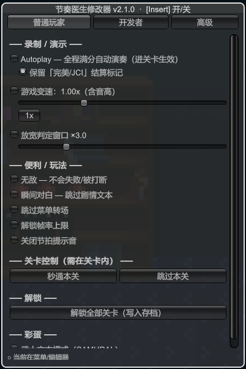
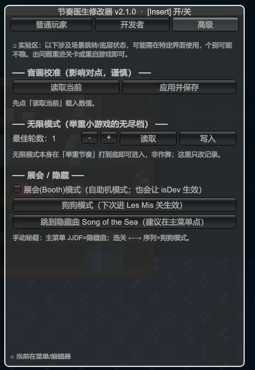
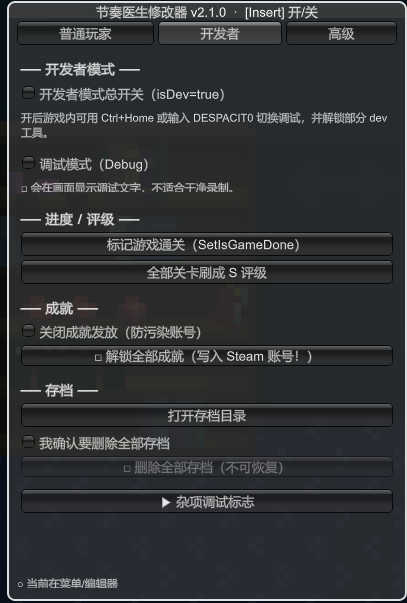

<!-- Language switch -->
**简体中文** | [English](README.en.md)

<div align="center">


# 🎵 节奏医生 修改器 · Rhythm Doctor Trainer

**按下 Insert，录制一段毫无瑕疵的满分通关 —— 不用练手速，也不用键盘宏。**

帧级满分 Autoplay · 保留「完美 / JCI」结算标记 · 0.1×–3× 变速 · 关卡直达 · 开发者解锁
一个基于 BepInEx 的《节奏医生》游戏内图形修改器，专为**单机录制完美通关**而生 —— 绝不用于在线对战。

<br>

[](LICENSE)
[](https://github.com/Cohenjikan/RhythmDoctorTrainer/releases)
[](https://github.com/Cohenjikan/RhythmDoctorTrainer/stargazers)
[](https://github.com/Cohenjikan/RhythmDoctorTrainer/issues)
[](https://github.com/BepInEx/BepInEx)
[](#-兼容性)
[](#-免责声明)

<br>

</div>

---

> [!IMPORTANT]
> **仅供单机自娱与录制**（例如制作完美通关视频）。本项目不触碰任何在线 / 对战 / 排行榜逻辑，也请勿用于会影响他人公平性的场景。与 7th Beat Games **无任何关联**。
>
> 💚 **完全免费、开源（MIT），严禁倒卖。** 内置完整性校验 —— 菜单标题与加载日志会显示本项目地址；删除或篡改该水印会让修改器**直接失效**。**如果你是花钱买来的，那你被人倒卖了** —— 请到本仓库免费获取。

## ✨ 它能做什么

《节奏医生》的核心是「在第 7 拍精准按下」。要全程满分，靠手速对点极难。这个修改器借用游戏引擎**自带的 autoplay**（把引擎原生的 `DebugSettings.Auto` 标志打开，由引擎按谱面自动演奏）—— **没有输入延迟，天生帧级满分，画面和真人手打完全一致**，而且刻意绕开了会闪出「autoplay on!」LED 字样的入口，录出来干干净净。

它不做内存扫描，只通过 BepInEx + HarmonyX 调用游戏**自身已有**的函数与开关，因此比传统修改器稳定得多，游戏小更新通常也不易失效。

## 🚀 核心功能

> 一个游戏内 IMGUI 浮层，四个标签页：**普通 / 开发者 / 高级 / 关卡直达**。

### 🎬 帧级满分 Autoplay（干净无水印）



引擎按谱面满分自动演奏，**无输入延迟、画面无「autoplay on!」LED 字样**，与真人手打无异 —— 配合隐藏 HUD 即可录出完美素材。

- ✅ 保留游戏在 autoplay 下通常会隐藏的 **「完美 / JCI」结算标记**（默认开启）
- ✅ 用的是引擎原生标志 `DebugSettings.Auto`，**不是键盘宏 / 模拟按键**
- ✅ 想自己手打？把开关关掉即可

<br clear="right">

### ⏱️ 游戏变速 0.1×–3×（含音高）

慢放抠细节、或加速速通；**BPM 与音源音高同步缩放**，听感一致。

> ⚠️ 在关卡**开始 / 重开**时生效，**无法中途变速**（引擎在加载时固定 BPM 与音高，中途改会失同步）。菜单内提供「重开本关并应用」按钮。

### 🎯 放宽判定窗口 · 🛡️ 无敌 · 便利项



- **放宽判定窗口 ×1–×10**（默认 ×3）—— 手打也能轻松全 Perfect
- **无敌** —— 永不失败、不被中途打断
- **瞬间对白 / 跳过菜单转场 / 解锁帧率上限 / 关闭节拍提示音**

### 🗺️ 关卡直达（绕过剧情 / NPC 解锁）

列出**全部关卡**（带文字筛选），点一下**直接进入**，绕过 hub 的剧情 / NPC 揭示限制 —— 配合 Autoplay 即可录制任意关卡，包括被剧情锁住的那些。

<br clear="right">

### 🔓 解锁与进度工具

- **解锁全部关卡**（写入存档）· **全部关卡刷 S** · **标记游戏通关** · **一键推进全部剧情**（铺满 hub 角色）

### 🛠️ 开发者 / 调试模式 + 成就控制



- **开发者模式（isDev）/ 调试模式（Debug）**，以及一组底层调试开关（NoPro / ForceNoSteamworks / EmulateMobile / RunningOnSteamDeck / DebugAmbience / PaigeStays / PauseOnFocusLost）
- **解锁全部成就**（⚠️ 会写入你的 Steam 账号）/ **关闭成就发放**（作弊时防污染账号）
- 打开存档目录、删除存档（二次确认）

> ⚠️ 调试模式会在画面显示调试文字，**不适合干净录制**。

<br clear="right">

### 🧪 高级：校准 / 无限模式记录 / 彩蛋

读取并应用音画校准值（视觉 / 输入 / 延迟）、编辑「举重节奏」无限模式最佳轮数、触发展会(Booth)模式 / 狗狗模式 / 隐藏曲 *Song of the Sea*。

### 🔒 防倒卖水印 + 完整性闸门

为保证工具永久免费：修改器在启动时对水印做 SHA256 校验，**删除或篡改项目地址水印 = 整个修改器拒绝工作**（不挂补丁、不应用任何功能、不弹菜单）。

## 📦 安装

适用于 **Steam 正式版**（Unity 6 / x64 / Mono）。需要先装 BepInEx 5。

### 第一步：装 BepInEx 5（x64, Mono）

1. 到 [BepInEx Releases](https://github.com/BepInEx/BepInEx/releases) 下载 **`BepInEx_win_x64_5.4.23.x.zip`**。
2. 把压缩包内容**解压到游戏根目录**（即与 `Rhythm Doctor.exe` 同一层；解压后会多出 `winhttp.dll`、`BepInEx/` 等）。
   > 🔍 游戏目录怎么找：Steam → 右键《Rhythm Doctor》→ 管理 → 浏览本地文件。
3. **启动一次游戏再退出**，让 BepInEx 生成 `BepInEx/plugins`、`BepInEx/config` 等文件夹。

### 第二步：装本修改器

**方法 A（手动，推荐）** —— 下载 [`dist/RDTrainer.dll`](dist/RDTrainer.dll)（约 23 KB），放进：

```text
<游戏目录>\BepInEx\plugins\RDTrainer.dll
```

**方法 B（脚本）** —— 克隆本仓库 → 编辑 [`tools/install.bat`](tools/install.bat) 里的 `GAME=` 路径（默认是常见 Steam 路径）→ 双击运行，它会把 `dist\RDTrainer.dll` 拷到 `BepInEx\plugins`。

### ✅ 验证

启动游戏后打开 `<游戏目录>\BepInEx\LogOutput.log`，看到这行即成功（水印部分按你的版本显示完整项目地址）：

```log
[Info : RD Trainer (节奏医生修改器)] RD Trainer (节奏医生修改器) v2.2.0 loaded · 本工具免费开源，严禁倒卖 · FREE · github.com/Cohenjikan/RhythmDoctorTrainer · Menu key = Insert
```

进入任意关卡，按 **Insert** 呼出菜单。

## 🎮 快速上手

1. 进入任意关卡，按 **Insert** 开 / 关菜单。
2. **录制完美通关**：在「普通」页打开 **Autoplay** → 进入关卡 → 用 OBS 等录屏。
3. **录被剧情锁住的关卡**：切到「**关卡直达**」页，点关卡名直接进入。
4. **变速**：拖动滑块后需在关卡**开始 / 重开**时生效（菜单内有「重开本关并应用」按钮）。
5. **想自己手打**：把「普通」页的 Autoplay 关掉即可。

## ⚠️ 须知 / 注意事项

- **仅单机 / 离线** —— 不触碰任何在线、对战、排行榜逻辑；请勿用于影响他人公平性的场景。
- **变速只在关卡开始 / 重开时生效**，不能中途变（引擎在加载时固定 BPM 与音高）；用「重开本关并应用」。
- **「解锁全部成就」会写入你真实的 Steam 账号** —— 介意者请配合「关闭成就发放」使用。
- **调试模式会在画面显示调试文字**，不适合干净录制。
- **删档 / 推进剧情等操作会修改你的存档文件** —— 删档不可恢复（有二次确认）。
- **修改游戏可能违反其 EULA / 服务条款**，使用风险自负（账号处罚、存档损坏均有可能）。
- **非官方粉丝工具**，与 7th Beat Games 无关联、未获授权；不分发任何游戏源码、DLL、音频或美术素材。
- **需要 BepInEx 5（x64, Mono）**；游戏大版本更新后可能需要适配才能继续加载，**不保证**永久兼容。
- **删除或篡改水印会让修改器整体失效**（设计如此，完整性闸门）。

## 🔧 从源码构建

需要 .NET SDK（构建 `netstandard2.1`）、一份已装 BepInEx 的游戏副本（用于引用 DLL）。

```bash
# 默认读取 D:\steam\steamapps\common\Rhythm Doctor；其它路径用 -p:GameDir=... 覆盖
dotnet build src/RDTrainer.csproj -c Release -p:GameDir="你的\Rhythm Doctor"
```

产物在 `src/bin/Release/RDTrainer.dll`。仓库通过 `Private=false` 引用游戏 DLL —— **不会重新分发**它们。

## ⚙️ 工作原理（简述）

修改器**不做内存偏移 / AOB 扫描**，只通过 BepInEx + HarmonyX 调用游戏自身已有的开关和函数：

| 功能 | 实现 |
|---|---|
| Autoplay | 设 `DebugSettings.instance.Auto`（刻意绕开会闪 LED 字样的 `ToggleAutoplay`） |
| 保留完美标记 | Harmony postfix 补丁 `LevelBase.isZeroOffset`（仅在零偏移且零失误时强制 true） |
| 变速 | 写静态 `scnGame.levelSpeed`，引擎在关卡 Start 时据此缩放 BPM 与音高 |
| 放宽判定 | postfix `scnGame.GetHitMargin` 乘以倍率 |
| 无敌 | 反射定位全程序集所有单参 `FailLevel`，prefix 跳过原逻辑 |
| 关卡直达 | 调用 `scnBase.GoToLevelWithEnum(Level)` |

只是「调用游戏自己的逻辑」，因此天然比内存修改稳定，游戏小更新通常也不易失效。详见 [ABOUT.md](ABOUT.md)。

## 🧹 卸载

- **只移除修改器**：删除 `<游戏目录>\BepInEx\plugins\RDTrainer.dll`（或运行 [`tools/uninstall.bat`](tools/uninstall.bat)）。
- **连 BepInEx 一起移除 / 恢复原版**：删除游戏根目录的 `winhttp.dll`（最快的「禁用 BepInEx」方式），或删 `winhttp.dll` + `BepInEx/` 文件夹 + `doorstop_config.ini`。
- 也可以在 Steam 里「验证游戏文件完整性」一键还原。

> 配置文件在 `<游戏目录>\BepInEx\config\com.cohen.rdtrainer.cfg`（可改菜单热键），卸载后可一并删除。

## 🖥️ 兼容性

| 项 | 值 |
|---|---|
| 游戏 | Rhythm Doctor（Steam 正式版） |
| 引擎 | Unity 6（6000.3.x）/ x64 / Mono |
| 加载器 | BepInEx 5.4.23.x |
| 目标框架 | netstandard2.1 |

> 游戏大版本更新后可能需要适配；若加载失败，先确认 BepInEx 版本与本说明一致。本项目**不保证**永久兼容。

## 📜 免责声明

- **非官方**：本项目是粉丝制作的非官方第三方工具，与游戏开发商 [7th Beat Games](https://rhythmdr.com/) **无任何关联**，亦未获其授权或认可。《Rhythm Doctor》及其名称、商标、美术与音乐等素材的一切权利归 7th Beat Games 所有。
- **不含游戏内容**：本仓库**仅含作者自行编写的插件代码**，不含也不分发游戏的任何源代码、DLL、音频、图像或其它素材；运行时只通过 BepInEx / HarmonyX 调用游戏**自身已存在**的公开函数，不做内存扫描。
- **仅限单机**：本工具仅供**离线单机**的自娱、练习与录制。请**勿**用于在线、排行榜、对战或任何会影响其他玩家公平性的场景。
- **遵守 EULA**：修改游戏可能违反其最终用户许可协议（EULA）/ 服务条款。是否使用由你自行决定，并须自行承担一切后果（如账号处罚、存档损坏等）。
- **不规避反作弊**：本工具不提供任何「绕过反作弊 / 防封号」的保证；「解锁全部成就」甚至会写入真实 Steam 账号。
- **完全免费**：本工具免费、开源（[MIT](LICENSE)），**严禁倒卖**；若你是付费获得的，请到本仓库免费获取。
- **版权方异议**：如相关版权方认为本项目有不当之处，可通过 GitHub Issue 联系，作者将配合下架或调整。

## 🙏 致谢

- 模组框架 [BepInEx](https://github.com/BepInEx/BepInEx) / [HarmonyX](https://github.com/BepInEx/HarmonyX)。
- 与姊妹项目「冰与火之舞修改器 / ADOFAI Trainer」同源同法（同为 7th Beat Games 出品）。

<div align="center">
<br>
本项目以 <a href="LICENSE">MIT</a> 许可证开源 · 免费 · 严禁倒卖
<br>
⭐ 如果它帮你录到了完美一遍，给个 Star 吧 · <a href="https://github.com/Cohenjikan/RhythmDoctorTrainer">github.com/Cohenjikan/RhythmDoctorTrainer</a>
</div>
